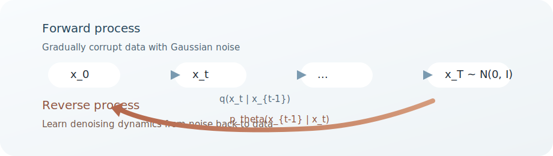

# 扩散模型导读

## 元信息

- Topic: generative-modeling
- Status: evergreen
- Last updated: 2026-03-29
- Source type: concept
- Primary references:
  - Denoising Diffusion Probabilistic Models
  - 与 score matching 相关的教程与参考资料
  - Flow Matching for Generative Modeling

## 一句话总结

各种 diffusion 风格模型背后都有一个共同想法：先选一条从数据分布走向噪声分布、易于分析的路径，再学习把噪声带回数据分布的逆向动力学。

## 为什么重要

这一类方法之所以重要，是因为它把困难的密度建模问题转化成局部预测问题，例如预测噪声、预测 score，或预测速度场。这样的局部目标往往更稳定、更容易扩展，也更容易加入条件控制。

## 核心思想

### 一个生成家族，三种常见参数化

- **DDPM 视角**：定义离散时间的 Markov 加噪链，并学习其反向链。
- **Score-based 视角**：学习逐渐加噪后的分布 \( \nabla_x \log p_t(x) \) 的 score，然后积分反向 SDE 或 ODE。
- **Flow-matching 视角**：直接定义概率路径 \( p_t \)，并回归把噪声运输到数据的向量场。

这三种看法彼此并不孤立。在很多实际设定中：

- DDPM 中的 epsilon-prediction 可以转换成 score 估计；
- score-based 模型中的 probability-flow ODE 给出一个确定性的 transport 视角；
- flow matching 则直接训练这样的 transport field，而不必在优化时显式模拟前向扩散链。

### 共同结构

这一主题下的大多数笔记都可以套进同一个模板：

1. 选取一条从数据到简单先验的路径 \( p_t \)；
2. 对每个噪声状态 \( x_t \) 推出一个局部监督目标；
3. 在采样时积分一个反向过程或 ODE。

## 重要细节

### 一个最小术语表

- **Forward process**：预先选定的数据到噪声路径。
- **Reverse process**：学习到的、把样本从噪声拉回数据的动力学。
- **Score**：\( \nabla_x \log p_t(x) \)，也就是对数密度上升最快的方向。
- **Velocity field**：\( v_t(x) \)，对应 ODE \( \dot{x}_t = v_t(x_t) \) 中的瞬时速度。
- **Probability path**：中间边缘分布族 \( \{p_t\}_{t \in [0,1]} \)。

### 接下来先读哪篇

- 如果你想先看最原始的离散时间推导，从 [DDPM 笔记](./ddpm-notes.md) 开始。
- 如果你想弄清扩散目标为什么和 score 联系在一起，读 [Score Matching 笔记](./score-matching-notes.md)。
- 如果你想理解更现代的 ODE transport 视角，读 [Flow Matching 笔记](./flow-matching-notes.md)。

### 可视化地图

## 我的笔记

我会把 diffusion、score-based model 和 flow matching 当成同一片地形上的三套坐标系来理解。它们的代数形式看起来不同，但真正想回答的问题很接近：神经网络到底该学习什么样的局部信号，才能重建全局的生成动力学？

## 开放问题

- 哪些概率路径会让向量场学习最容易？
- 在什么情况下，随机的反向过程会优于确定性的 ODE 求解？

## 相关笔记

- [统一模型](../unified-models/index.md)

## 参考资料

- [Ho, Jain, Abbeel (2020), *Denoising Diffusion Probabilistic Models*](https://arxiv.org/abs/2006.11239)
- [Lilian Weng, *What are Diffusion Models?*](https://lilianweng.github.io/posts/2021-07-11-diffusion-models/)
- [Yang Song, *Generative Modeling by Estimating Gradients of the Data Distribution*](https://yang-song.net/blog/2021/score/)
- [Lipman et al. (2023), *Flow Matching for Generative Modeling*](https://arxiv.org/abs/2210.02747)
